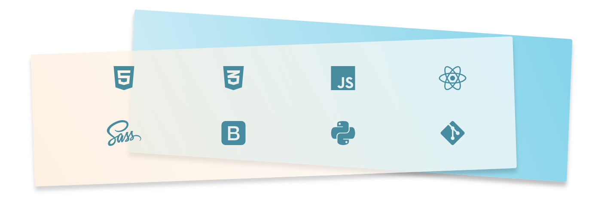

### Hi, I'm Lowic! Welcome to my code warehouse! 👋

Former Python developer who was a former math teacher, I make my own way to become a design engineer.

- 🌱 I’m currently learning _Redux_, to complete my skills about _React.js_.
- 🔭 Next I'll learn _TypeScript_ and _Next.js_, then deal with UI & UX design in depth.

### How to contact me

- [LinkedIn](https://www.linkedin.com/in/lowic-mangin)
- [Twitter](https://twitter.com/__L_Mangin__)
