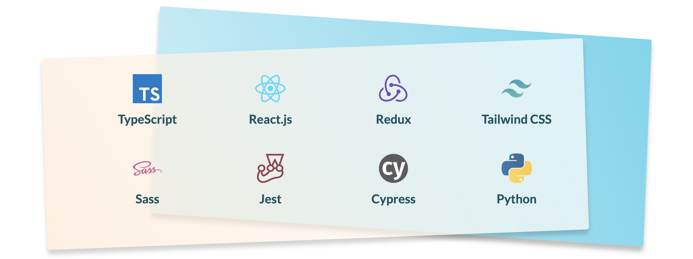

## Hi, I'm Lowic! Welcome to my code warehouse! 👋

Former Python developer and former math teacher, I make my own way to **become a UX engineer / designOps** (front-end developer and UI/UX designer combo).

- 🌱 I’m currently going deeper into testing (_Jest / Testing Library / Cypress_), _TypeScript_ and UI/UX.
- 🔭 Next I'll learn more about OOP design patterns, functional programming and _Remix_..

### How to contact me

- [LinkedIn](https://www.linkedin.com/in/lowic-mangin)
- [Twitter](https://twitter.com/__L_Mangin__)
