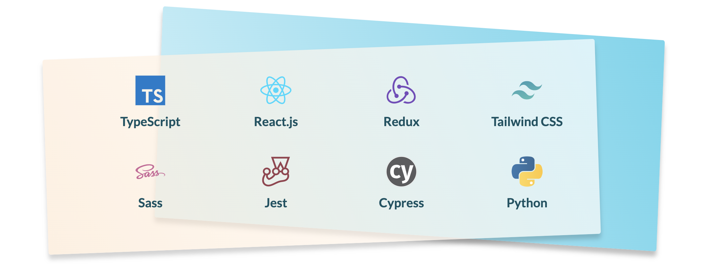

## Hi, I'm Lowic! Welcome to my code warehouse! 👋

As an **UX Engineer**, I am a combination of a Front-end developer and UI/UX designer.

My specialities are developpement with _React.js_ and _TypeScript_, UX heuristics (do's and dont's in UX) and web accessibility (a11y).

🌱 Currently, I am **specializing into accessibility** and preparing an [Access42 certification](https://formations.access42.net/certifications/developper-des-sites-web-accessibles/).

You can contact me on [_LinkedIn_](https://www.linkedin.com/in/lowic-mangin). 🙂
